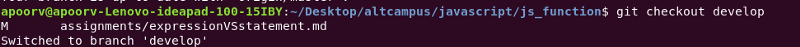

### 1\. git init

**Usage: git init \[repository name\]**

This command is used to start a new repository.

### 2\. git clone

**Usage: git clone \[url\]**

This command is used to obtain a repository from an existing URL.

### 3\. git status

**Usage: git status**

This command lists all the files that have to be committed.

### 4\. git branch

**Usage: git branch**

This command lists all the local branches in the current repository.

### 5\. git checkout

**Usage: git checkout \[branch name\]**

This command is used to switch from one branch to another.

That’s it, these were the 5 basic git commands.

### **Happy Coding!**
