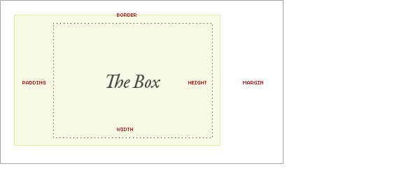
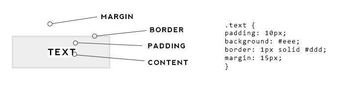

### What is the box model?

Every HTML element is, at its most basic form, a box. The box model is used to describe an element’s dimensions and structure. It is made up of four boxes: content-box, padding-box, border-box, and margin box.

In the center, you have the main content or element. This could be an image, a button, some text or something else. We then have the padding around that, then the border area and finally the margin area on the outside. These values can contribute to the height and width of an element.

Let’s take a closer look at each part of the box model and how they contribute to an element’s overall size.

### Content

The content-box is the inner-most property of the box model. It is defined by the height and width properties in CSS. By default, the content box is defined by whatever is inside the element. It will expand and contract depending on its content.

### Padding & Margin

It’s important to remember that the **margin** is space outside an element while the **padding** is the space inside an element. What does that mean? Adding padding values will add space around the element if it has other style attributes such as a background or border they will be affected by the padding. Adding margin values will add space outside of the element, so it will be separate from the content around it such as other text.

There are so many examples of how to use these both. We could add padding and background to text to create a button and add a margin to separate that button from other content around it like text or images. We can use one value to set an equal space on all four sides. We can also set the value individually for each side using margin-top, margin-right, margin-bottom, margin-left, padding-top, padding-right, padding-bottom and padding-left.

### Border

The border sits between the padding and the margin. Although a border is seemingly similar to those, the CSS for applying a border is slightly different, there needs to be width, stroke, and color.
