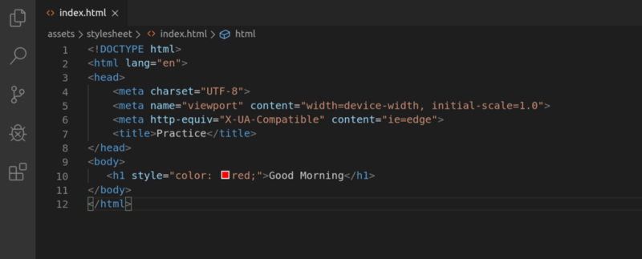
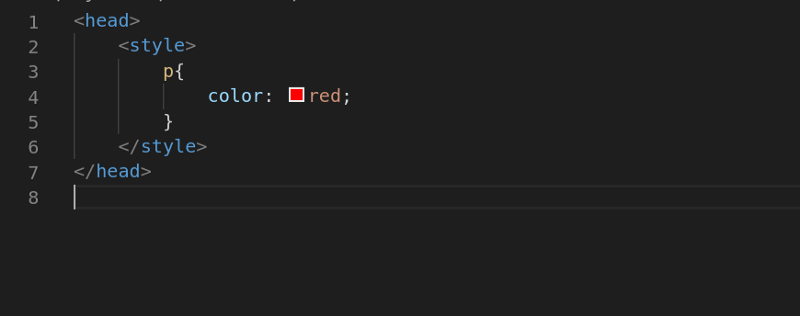
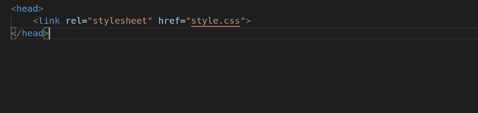
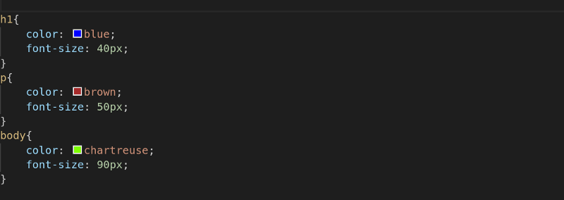

CSS is the acronym for: ‘Cascading Style Sheets’. CSS is an extension to basic HTML that allows you to style your web pages.CSS is the language that allows you to make webpages pretty. It gives you the ability to control every visual aspect of a page, from text and background colors to widths, heights, and margins.

**Referencing a Cascading Style Sheet**

There are three ways to define CSS -:

1.  **Inline CSS**

First off, we can include CSS directly in our HTML elements. For this, we make use of the style attribute and then we provide properties to it.

Here we’re giving it the property of **color** and setting the value to **red ,** which results in the following:

We can also set multiple properties inside the `style` tag if we want to. But things will get quite messy that’s why the second method was introduced.

2\. Internal CSS

In this method, we use the **style** element in the **head** section of the HTML document. This is called Internal Styling.

In the style element, we can give the styling to our HTML elements by selecting the elements and provide styling attributes. Just like we applied the color property to the p element above.

3. **External CSS**

The third and most famous and recommended way to include CSS is using an external stylesheet. We create a stylesheet with a .css extension and include its link in the HTML document, like this:

In the code above, we have included the link of style.css file using the link element. We then write all of our CSS in a separate stylesheet called style.css so that it’s easily manageable.

I will soon publish the next article of the series.

**Keep Coding!**
