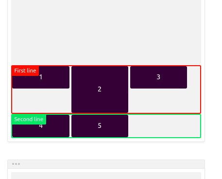

Flexbox also known as flexible box is a type of layout model in CSS that makes it super easy to design responsive layouts.

The whole idea behind the Flexbox layout model is to allow elements to be laid out in any direction, flex their size to either fill up unused space or shrink to avoid overflowing their parent element, either horizontally or vertically.

To truly be able to flex with Flexbox, we have to understand how it works.

Let’s break it down into its properties into two namely;

1.  Flex Container
2.  Flex Items

### Flex Container

This is the parent html element that houses the items you want to lay out.

To use any of the flex properties, this container has to be created.

It’s what creates the context that allows every other flex properties to work.

#### align-items

This allows you to align the items in the flex container vertically, regardless of the height of the item with respect to their flex container or each other.

The values it accepts are: **_flex-start_** | **_flex-end_** | **_center_** | **_baseline_** | **_stretch_**

`align-items: flex-start;`

The flexbox items are aligned at the **start** of the **cross axis**.

By default, the cross axis is vertical. This means the flexbox items will be aligned _vertically_ at the _top_.

`align-items: flex-end;`

The flexbox items are aligned at the **end** of the **cross axis**.

By default, the cross axis is vertical. This means the flexbox items will be aligned _vertically_ at the _bottom_.

`align-items: center;`

The flexbox items are aligned at the **center** of the **cross axis**.

By default, the cross axis is vertical. This means the flexbox items will be **centered** _vertically_.

`align-items: baseline;`

The flexbox items are aligned at the **baseline** of the **cross axis**.

By default, the cross axis is vertical. This means the flexbox items will align themselves in order to have the _baseline_ of their _text_ align along a horizontal line.

`align-items: stretch;`

The flexbox items will stretch across the whole **cross axis**.

By default, the cross axis is vertical. This means the flexbox items will fill up the whole vertical space.

#### justify-content

This is the opposite of **align-items,** it aligns its item horizontally regardless of the width of the item with respect to their container or each other.

Values: **_flex-start_** | **_flex-end_** | **_center_** | **_space-between_** | **_space-around_** | **_space-evenly._**

`justify-content: flex-start;`

The flexbox/grid items are pushed towards the **start** of the container’s main axis.

`justify-content: flex-end;`

The flexbox/grid items are pushed towards the **end** of the container’s main axis.

`justify-content: center;`

The flexbox/grid items are **centered** along the container’s main axis.

`justify-content: space-between;`

The remaining space is distributed **between** the flexbox/grid items.

`justify-content: space-around;`

The remaining space is distributed **around** the flexbox/grid items: this adds space _before_ the first item and _after_ the last one.

#### flex-wrap

The `flex-wrap` property specifies whether the flex items should break to the next line or not.

By default all flex items will try to fit in a single line, but this property tells the browser to break them into another line when they become way too many to fit in a single line.

This line we speak of is also known as a F**lex line**.

Values: **_nowrap_** | **_wrap_** | **_wrap-reverse_**

`flex-wrap: nowrap;`

The flexbox items will remain on a **single line**, no matter what, and will eventually overflow if needed.

`flex-wrap: wrap;`

The flexbox items will be distributed among **multiple lines** if needed.

`flex-wrap: wrap-reverse;`

The flexbox items will be distributed among **multiple lines** if needed. Any additional line will appear **before** the previous one.

#### align-content

This property modifies the behavior of the **flex-wrap** property.

It essentially behaves like the **align-items** property, only that it aligns the flex lines instead of the flex items.

To make this property work, `flex-wrap: wrap` has to be set on the flex container and the flex lines have to be more than one.

Values: **_flex-start_** | **_flex-end_** | **_center_** | **_space-between_** | **_space-around_** | **_stretch_**

`align-content: stretch;`

Each line will stretch to _fill_ the remaining space.

In this case, the container is `300px` high. All boxes are `50px` high, apart from the second one who is `100px` high.

-   The first line is **100px** high
-   The second line is **50px** high
-   The remaining space is **150px**

This remaining space is distributed equally amongst the two lines:

-   The first line is now **175px** high
-   The second line is now **125px** high

`align-content: flex-start;`

Each line will only fill the space it _needs_. They will all move towards the **start** of the flexbox/grid container’s cross axis.

`align-content: flex-end;`

Each line will only fill the space it _needs_. They will all move towards the **end** of the flexbox/grid container’s cross axis.

`align-content: center;`

Each line will only fill the space it _needs_. They will all move towards the **center** of the flexbox/grid container’s cross axis.

`align-content: space-between;`

Each line will only fill the space it _needs_. The _remaining_ space will appear **between** the lines

`align-content: space-around;`

Each line will only fill the space it _needs_. The _remaining_ space will be distributed equally **around** the lines: before the first line, between the two, and after the last one.

#### flex-direction

This defines which direction the browser should stack the Flex items i.e vertically or horizontally.

Values: **_row_** | **_row-reverse_** | **_column_** | **_column-reverse_**

`flex-direction: row;`

The flexbox items are ordered the **same** way as the **text direction**, along the **main axis**.

`flex-direction: row-reverse;`

The flexbox items are ordered the **opposite** way as the **text direction**, along the **main axis**.

`flex-direction: column;`

The flexbox items are ordered the **same** way as the **text direction**, along the **cross axis**.

`flex-direction: column-reverse;`

The flexbox items are ordered the **opposite** way as the **text direction**, along the **cross axis**.

So these were the flex container properties and in the next part, we will cover properties of flex items.

**Happy Coding!**
