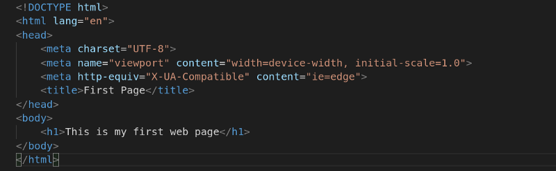
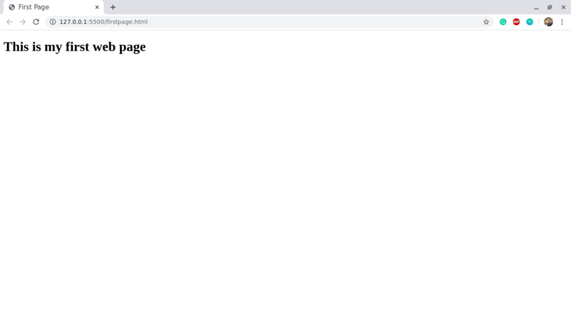

HTML stands for Hypertext Markup Language. It is the language used for creating websites and web applications. HTML was first developed by Tim Berners- Lee in 1990.

### Tags and Attributes

An HTML tag surrounds the content and applies meaning to it and they are enclosed in angle brackets. An example of a tag is `
`. Tags are the building blocks of HTML. You can’t do HTML without tags. Most of the tags must be opened `
` and closed `
` in order to function but some tags like ` ` and `` are self closing tags. Every HTML document starts with `<html>` tag and ends with `</html>` tag.

An attribute in HTML provides extra information about the element, and it is applied within the start tag. An HTML attribute contains two fields: name & value. An example of an attribute is: ``, In this case, the image source(src) is the attribute and laptop.jpg is the value.

### Where to write HTML?

To write HTML you need an HTML editor. There are multiple free and paid editors available on the internet. Some of the most famous are : Sublime text 3, Microsoft Visual Studio Code, Atom, Notepad++, etc. You can download any of these and start your journey with HTML.

### Creating your first HTML Webpage

`**<!DOCTYPE html>** - <!**DOCTYPE**>` **tag** is used to inform the browser about the version of **HTML** used in the document. In this case the version is html5

`**<html lang =”en”>**`\- The lang attribute specifies the language of the element’s content. Here “en” stands for english.

`**<head>**`**\- T**he `<**head**>` **tag** is used to contain specific information about a web page, often referred to as metadata. This information includes things like the title of the document, as well as scripts or links to scripts, and CSS files.

`**<title>**`**\-** This is where we title of the page  as it will appear at the top of the browser window or tab.

`**<body>**`**\-** The `<**body**>` element contains all the contents of an **HTML** document, such as text, hyperlinks, images, tables, lists, etc.

### Heading in HTML

There are six heading tags in HTML: `<h1>` to `<h6>`, with the `<h1>` tag indicating the most important heading and the `<h6>` tag indicating the least important heading.

**HTML Heading Example**

-   `<h1>`This is Your First HTML Heading`</h1>` (the largest)
-   `<h2>`This is Your Second HTML Heading`</h2>`
-   `<h3>`This is Your Third HTML Heading`</h3>`
-   `<h4>`This is Your Fourth HTML Heading`</h4>`
-   `<h5>`This is Your Fifth HTML Heading`</h5>`
-   `<h6>`This is Your Sixth HTML Heading`</h6>`

**Paragraph in HTML**

Paragraphs can be created with the `
` tag.We place all of our regular text inside the element `
`.

HTML Paragraph Example

`
` This is a paragraph`
`

### How To Run HTML file

Firstly save the html file with .html extension and then open it in your browser.

This ends part 1 of this article. Soon I will publish the 2nd part of it.

**Keep Coding!**
